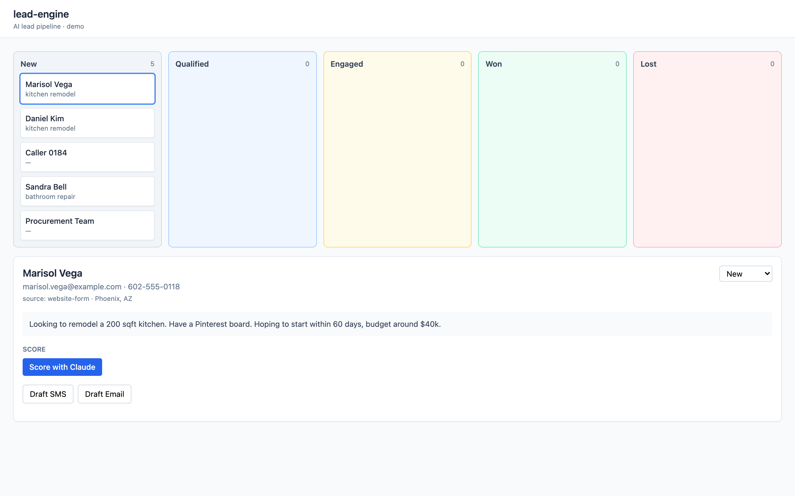

# lead-engine

[](https://github.com/anthonyonazure/lead-engine/actions/workflows/ci.yml)
[](https://opensource.org/licenses/MIT)
[](https://nodejs.org)
[]()
[](https://anthropic.com)

**AI-driven lead management for small businesses. Capture → qualify → score → outreach → track. Not a chatbot.**

Most "lead automation" gigs land in one of two ditches: a pile of SaaS subscriptions (Zapier + HubSpot + Twilio + ConvertKit + a dashboard tool) that breaks on the first vendor change, or a custom monolith only its author can maintain. This is the middle path — a single small codebase that does the actual jobs, runs in 60 seconds, and is simple enough to hand off.



## What's inside

- **Lead capture API** — webhooks for website forms and missed-call text-back (auto-sends a Twilio SMS reply)
- **AI qualification** — Claude scores fit, urgency, reachability, signal quality with structured output
- **Outreach drafting + sending** — Claude drafts personalized SMS via Twilio and email via Postmark; every draft is reviewable, editable, and sent on demand from the dashboard
- **Pipeline dashboard** — stage board with drill-in, outreach history per lead with status badges (draft / sent / simulated / error)
- **Audit trail** — every Anthropic call logged with input tokens, output tokens, cache reads, latency, and computed cost in USD; every outreach attempt logged with provider ID and timestamps

## Stack

- **Frontend** — Vite + React 18 + TypeScript + Tailwind
- **Backend** — Node 20 + Express + better-sqlite3
- **AI** — Anthropic Claude (Haiku for scoring, Sonnet for drafting) with prompt caching and tool-use forcing
- **SMS** — Twilio (graceful simulation mode when not configured)
- **Email** — Postmark (graceful simulation mode when not configured)
- **Storage** — SQLite (single file, no setup) — swap for Postgres in production with one ALTER per table

## Quickstart

```bash
pnpm install
cp .env.example .env  # add ANTHROPIC_API_KEY
pnpm seed             # loads 5 sample leads (qualified, tire-kicker, missed call, urgent, spam)
pnpm dev              # starts API on :3001 and web on :5173
```

Open http://localhost:5173.

## Production AI patterns demonstrated

- **Prompt caching** — system prompts marked `cache_control: ephemeral`. ~10× cost reduction on repeat calls within the 5-minute window.
- **Structured output via tool use** — every AI op defines an Anthropic tool with a strict input schema. No JSON parsing failures, ever.
- **Cost & latency logging** — every call writes to `ai_calls` with token counts, model, latency, and cost. Non-optional for production: needed to debug regressions, bill clients, choose models.
- **Model tiering** — Haiku for scoring (cheap, deterministic enough for a numeric output), Sonnet for drafting (worth the cost for tone). Both env-configurable.
- **Human-in-loop UI** — every AI suggestion is reviewed before it sends. Claude drafts, the user approves.

Configure SMS/email by adding `TWILIO_*` and `POSTMARK_*` to `.env`. Without those, outbound channels run in simulation mode (logs to console, marks the outreach record as `simulated`) — useful for local dev and CI. Production-ready architecture details: [`docs/architecture.md`](docs/architecture.md)

## Project layout

```
lead-engine/
├── client/           # Vite + React dashboard
│   ├── src/components/   # PipelineBoard, LeadDetail
│   └── src/lib/          # API client
├── server/           # Express API + Claude integration
│   ├── routes/           # /api/leads, /api/ai, /api/webhooks
│   ├── services/         # claude.ts, score.ts, outreach.ts
│   └── prompts/          # System prompts (markdown — non-engineers can edit)
├── data/             # SQLite db + seed script
└── docs/
    ├── architecture.md
    └── assets/dashboard.png
```

## Why these choices

Small businesses don't want six SaaS subscriptions. They want one system that works, that they can afford, that doesn't break on Tuesday because Zapier changed an API. lead-engine is a single repo, single command to run, with prompts living in plain markdown so the owner can edit them without a developer.

## Security

This is a portfolio piece, not a production CRM, but it's been audited and the obvious sharp edges are filed:

- **Shared API key auth.** All non-webhook routes require `x-api-key`. Frontend reads `VITE_LEAD_ENGINE_API_KEY` at build time. In production with `LEAD_ENGINE_API_KEY` unset, the server returns 503 instead of opening up.
- **Helmet** for standard security headers; `x-powered-by` disabled.
- **CORS allowlist** via `LEAD_ENGINE_WEB_ORIGIN` (comma-separated). No reflective `*`.
- **Rate limits** — 30/hr on `/api/ai/*`, 60/hr on `/api/outreach/*/send`, 30/min on `/api/webhooks/*`. Cuts off cost-amplification attacks before they hurt.
- **Twilio signature verification** on `/api/webhooks/missed-call` when `TWILIO_AUTH_TOKEN` is set. Without verification + an outbound phone allowlist (`TWILIO_ALLOWED_COUNTRIES`, default `+1`), the missed-call webhook would be a SMS-pumping attack vector.
- **E.164 validation + country allowlist** on every outbound SMS, even in simulation mode — no premium-rate / international-fraud blast radius.
- **Input sanitization** at every public boundary — `lead.notes` capped at 4 KB, name/email/phone/etc. capped at 200-500 bytes, all control chars stripped before persistence and before flowing into LLM prompts.
- **Prompt-injection delimiters** — submitter-controlled lead fields are wrapped in `<<UNTRUSTED>>...<</UNTRUSTED>>` and the system prompt explicitly tells the model to treat that content as data, not commands.
- **Body size 16 KB** (down from 256 KB) — sized for legitimate lead forms, not for bulk-scraped payloads driving up AI cost.
- **Production error responses** are generic (`'internal error'`); full traces logged server-side only.

For real production deployment, you'd still want session-based auth + RBAC, encrypted SQLite at rest, and an inbound SMS reply handler — see `docs/architecture.md`.

## Tests

31 unit tests cover lead CRUD, stage transitions, webhook handling (including end-to-end missed-call → SMS text-back), the API-key middleware, the outbound-SMS country allowlist, input sanitization, and graceful-degradation behavior for both SMS and email. Runs in CI on every push and pull request.

```bash
pnpm test         # run once
pnpm test:watch   # watch mode
pnpm typecheck    # both server and client
pnpm build        # production build
```

The AI scoring/drafting endpoints hit the Anthropic API. They are not exercised in CI but the test suite exercises every other layer (routes, db, sms/email simulators, webhooks).

## License

MIT
